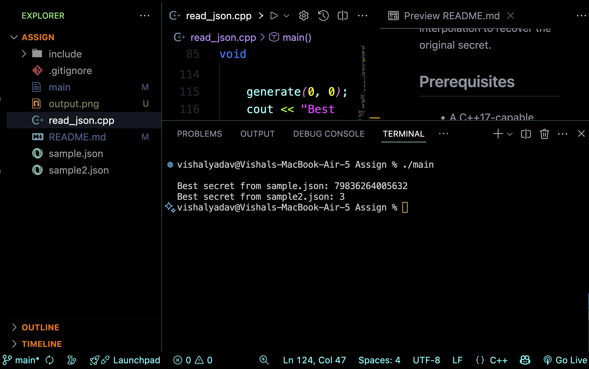

# Catalog-Placements-Assignment-Hashira

## Overview  
This project reads JSON-encoded shares of a secret, converts each share from its given base to decimal,  
and then performs Lagrange interpolation to recover the original secret.

## Prerequisites  
- A C++11-capable compiler (e.g. g++, clang++)  
- [nlohmann/json](https://github.com/nlohmann/json) header only library  

## Build  
```bash
g++ read_json.cpp -std=c++11 -o main -Iinclude 
```

## Run  
Place your JSON files (`sample.json`, `sample2.json`, etc.) in the same directory, then:
```bash
./main
```

## Sample Output  
Below is an example of running the program and its recovered secrets:



